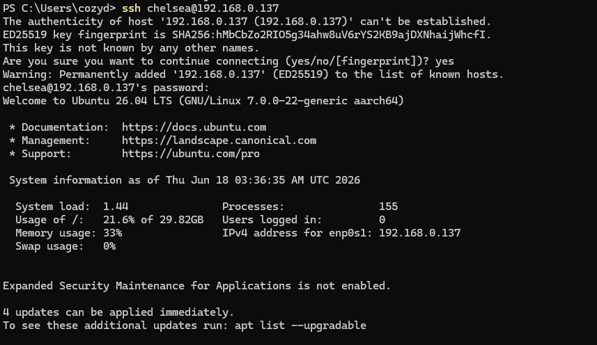
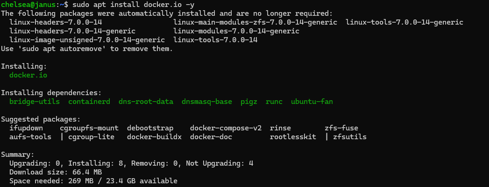
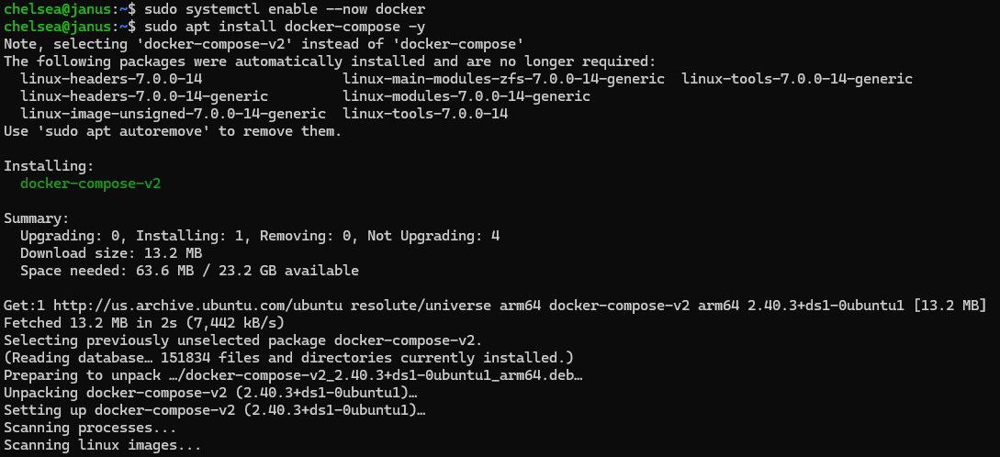
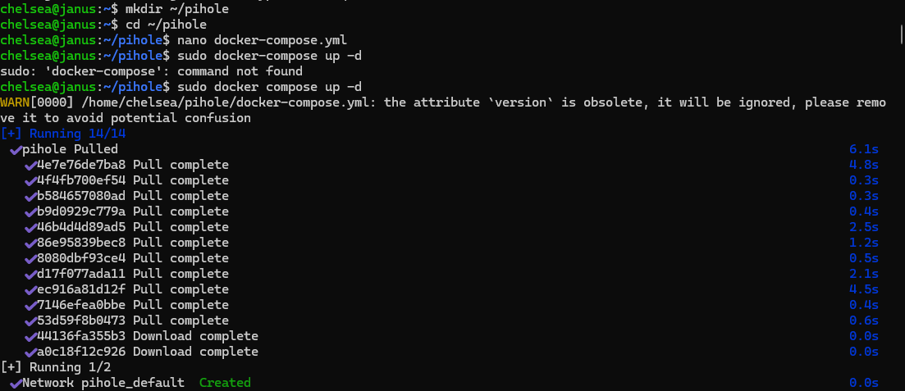
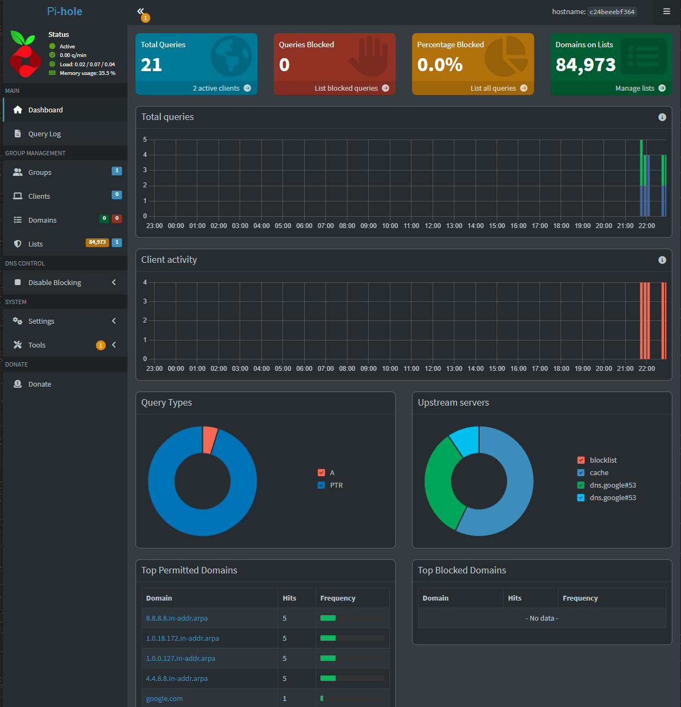
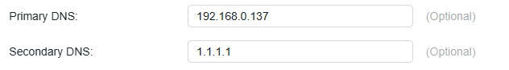

# pihole-homelab
Normally, PiHole is not supported on macOS due to conflicts with the internal Apple DNS resolver. Since I already use an M1 MacBook Pro as a Jellyfin media server, I wanted to find a way to work around this limitation. The solution was an Ubuntu Server VM controlled by Apple-native UTM.

# Pi-hole Home Lab: Network-Wide Ad Blocking with Docker on Ubuntu Server


-black?style=flat&logo=apple&logoColor=white)

A self-hosted network-wide DNS ad blocker deployed as a Docker container on an Ubuntu Server VM running on an Apple M1 MacBook Pro via UTM. All LAN devices are routed through Pi-hole at the router level — no per-device configuration required.

---

## Table of Contents

- [Overview](#overview)
- [Architecture](#architecture)
- [Technologies Used](#technologies-used)
- [Implementation](#implementation)
  - [Step 1 — Provision Ubuntu Server VM in UTM](#step-1--provision-ubuntu-server-vm-in-utm)
  - [Step 2 — Install Docker](#step-2--install-docker)
  - [Step 3 — Enable Docker & Install Docker Compose](#step-3--enable-docker--install-docker-compose)
  - [Step 4 — Configure docker-compose.yml](#step-4--configure-docker-composeyml)
  - [Step 5 — Deploy Pi-hole](#step-5--deploy-pi-hole)
  - [Step 6 — Verify the Dashboard](#step-6--verify-the-dashboard)
  - [Step 7 — Point Router DNS to Pi-hole](#step-7--point-router-dns-to-pi-hole)
- [Results](#results)
- [Future Improvements](#future-improvements)

---

## Overview

This project provisions a lightweight Ubuntu Server virtual machine on Apple Silicon using UTM (QEMU/KVM), then deploys Pi-hole inside a Docker container using Docker Compose. The VM is given a static LAN IP and set as the home router's primary DNS server, enabling DNS-level ad and tracker blocking across every device on the network without requiring any browser extensions or per-device setup.

---

## Architecture

```
[All LAN Devices]
       │
       ▼
[Home Router — Primary DNS: 192.168.0.137]
       │
       ▼
[Ubuntu Server VM — UTM/QEMU on M1 MacBook Pro]
[IP: 192.168.0.137 | Kernel: Linux 7.0.0-22 aarch64]
       │
       ▼
[Docker Container — Pi-hole]
[Port 53: DNS | Port 80: Web UI]
       │
       ▼
[Upstream DNS — Cloudflare 1.1.1.1 / 1.0.0.1]
```

---

## Technologies Used

| Category | Technology |
|---|---|
| Virtualization | UTM (QEMU/KVM) on Apple Silicon (ARM64) |
| Operating System | Ubuntu Server 26.04 LTS |
| Remote Access | SSH from Windows PowerShell |
| Containerization | Docker, Docker Compose v2 |
| Networking | DNS resolution, LAN routing, static IP |
| Application | Pi-hole (DNS sinkhole / ad blocker) |
| Configuration | YAML, systemd |

---

## Implementation

### Step 1 — Provision Ubuntu Server VM in UTM

Ubuntu Server 26.04 LTS was installed as an ARM64 VM on an M1 MacBook Pro using UTM. The VM was configured with a bridged network adapter to sit directly on the LAN at a static IP (`192.168.0.137`). All subsequent administration was performed remotely over SSH from a Windows machine.


*SSH into Ubuntu Server 26.04 LTS — kernel 7.0.0-22-generic (aarch64), 33% memory usage, LAN IP 192.168.0.137*

---

### Step 2 — Install Docker

Docker was installed via `apt` using the `docker.io` package, which pulls in all required runtime dependencies including `containerd` and `runc`.

```bash
sudo apt install docker.io -y
```


*Installing docker.io and dependencies — 8 packages, 66.4 MB download, 269 MB disk usage*

---

### Step 3 — Enable Docker & Install Docker Compose

The Docker daemon was enabled as a systemd service so it starts automatically on boot, then Docker Compose v2 was installed.

```bash
sudo systemctl enable --now docker
sudo apt install docker-compose -y
```


*Docker enabled via systemd; Docker Compose v2 (2.40.3) installed successfully*

---

### Step 4 — Configure docker-compose.yml

A `pihole/` project directory was created and a `docker-compose.yml` was written to define the Pi-hole service. Port `53` (TCP/UDP) handles DNS traffic; port `80` serves the web admin UI. Persistent volumes preserve Pi-hole's configuration and blocklists across container restarts.

```bash
mkdir pihole && cd pihole
nano docker-compose.yml
```

```yaml
version: "3"

services:
  pihole:
    container_name: pihole
    image: pihole/pihole:latest
    environment:
      TZ: "America/Los_Angeles"
      FTLCONF_webserver_api_password: '***redacted***'
      DNS1: 1.1.1.1
      DNS2: 1.0.0.1
      ServerIP: 192.168.0.137
    volumes:
      - ./etc-pihole:/etc/pihole
      - ./etc-dnsmasq.d:/etc/dnsmasq.d
    ports:
      - "53:53/tcp"
      - "53:53/udp"
      - "80:80/tcp"
    restart: unless-stopped
```

---

### Step 5 — Deploy Pi-hole

Docker Compose pulled the latest Pi-hole image and launched the container in detached mode, automatically creating an isolated `pihole_default` bridge network.

```bash
docker compose up -d
```


*Docker Compose pulling Pi-hole image layers and creating the pihole_default bridge network*

---

### Step 6 — Verify the Dashboard

The Pi-hole web admin dashboard was accessed at `http://192.168.0.137/admin`, confirming the container was active and processing DNS queries. The default blocklist loaded **84,973 domains** out of the box.


*Pi-hole admin dashboard — active status, 84,973 blocked domains on list, live query metrics and upstream DNS breakdown*

---

### Step 7 — Point Router DNS to Pi-hole

The router's primary DNS was updated to `192.168.0.137` with `1.1.1.1` as a fallback. This single change routes all DNS queries from every LAN device through Pi-hole automatically.

| Field | Value |
|---|---|
| Primary DNS | `192.168.0.137` (Pi-hole VM) |
| Secondary DNS | `1.1.1.1` (Cloudflare — fallback) |


*Router DNS settings updated — Primary DNS pointed to the Pi-hole VM*

---

## Results

- ✅ All LAN devices route DNS queries through Pi-hole with zero per-device configuration
- ✅ 84,973-domain blocklist active immediately on first boot
- ✅ Ads and trackers blocked at the DNS level before content is loaded
- ✅ Containerized deployment enables simple updates: `docker compose pull && docker compose up -d`
- ✅ Persistent volumes retain blocklists and config across container restarts

---

## Future Improvements

- [ ] Add **Unbound** as a local recursive resolver for full DNS privacy (no upstream query logging)
- [ ] Configure **HTTPS/TLS** for the web UI using nginx as a reverse proxy with a self-signed cert
- [ ] Set up **container health monitoring** and automated alerting
- [ ] Explore **Portainer** for visual Docker management across the home lab
